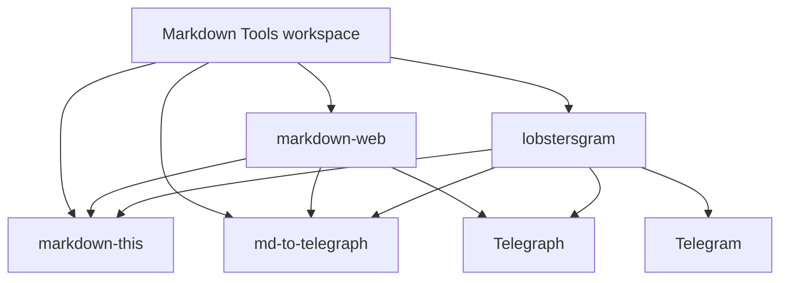

# Markdown Tools

[](https://github.com/mgaitan/lobstersgram/actions/workflows/ci.yml)

Markdown Tools is a Python monorepo for extracting web content as Markdown,
publishing Markdown to Telegraph, and running the small services that connect
those pieces to Telegram and the web.

The repository started as Lobstersgram, but the reusable Markdown projects are
now first-class packages.

## Projects

- [`markdown-this`](packages/markdown-this/README.md): extracts web pages and
  supported special URLs as Markdown.
- [`md-to-telegraph`](packages/md-to-telegraph/README.md): converts Markdown
  into Telegraph DOM nodes and publishes Telegraph pages.
- [`markdown-web`](packages/markdown-web/README.md): FastAPI service with web
  UI, URL endpoints, document upload, image upload, bookmarklets, and Telegraph
  publishing.
- [`lobstersgram`](src/lobstersgram/): Telegram application that posts Lobsters
  links with clean Telegraph reading views.



## Documentation

Central docs live in [`docs/`](docs/). The Sphinx index includes this README
and then splits each project into overview, installation/usage, and technical
reference pages.

Build the docs locally with:

```bash
uv run --group docs sphinx-build -b html docs docs/_build/html
```

## Common Commands

```bash
uv sync
uv run pytest -q
uv run ruff check .
uv run ruff format --check .
uv build --all-packages
```

Run the web service locally with:

```bash
uv run --package markdown-web markdown-web
```

It exposes `/md/{url}` for Markdown and `/t/{url}` for Telegraph publishing.
The public web app is available at <https://markdown.fastapicloud.dev/>.

Run the Lobstersgram app manually with:

```bash
uv run lobstersgram --help
```

## Releases

Packages are versioned and released independently. For example:

```bash
uv version --package markdown-this --bump patch
uv lock
git commit -am "Release markdown-this $(uv version --package markdown-this --short)"
git tag "markdown-this-v$(uv version --package markdown-this --short)"
git push origin master --tags
```

The publishing workflows are package-specific:

- `publish-markdown-this.yml` publishes `markdown-this`.
- `publish-md-to-telegraph.yml` publishes `md-to-telegraph`.

`markdown-web` and `lobstersgram` are applications in this workspace and are
not published to PyPI.

## Package Boundaries

- Keep reusable extraction in `packages/markdown-this`.
- Keep Telegraph Markdown conversion and API publishing in
  `packages/md-to-telegraph`.
- Keep web-service orchestration in `packages/markdown-web`.
- Keep Telegram/Lobsters scheduling, persistence, and channel behavior in
  `src/lobstersgram`.

The practical rule is boring: reusable packages should not import application
modules.
