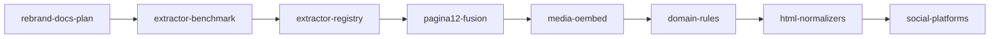

# markdown-this Extractor Roadmap

Esta propuesta cubre los issues #83, #88, #91, #92, #93, #97 y los
relacionados #84, #89, #90, #94 y #95.

## Objetivo

Soportar sitios problematicos como Pagina/12 y plataformas como YouTube,
Vimeo, X, Reddit, Hacker News, Medium/Substack y Discourse con menos filtros
sueltos. La direccion es un pipeline por estrategias, inspirado en Readeck y
Defuddle, pero sin copiar miles de reglas antes de tener fixtures propios.

## Propuesta De Pipeline

1. Fetch HTML o aceptar HTML provisto por navegador/bookmarklet.
2. Extraer metadata temprana: OpenGraph, canonical, JSON-LD/schema.org,
   oEmbed links y datos especificos seguros.
3. Ejecutar extractores especializados por URL/DOM, con prioridad explicita.
4. Aplicar reglas declarativas pequenas: `body`, `strip`, `title`, `author`,
   `date`, `next` y `single_page`.
5. Usar Readability como fallback generico.
6. Normalizar HTML antes de Markdown: lazy images, figuras, footnotes, code
   blocks, math, callouts, tablas y embeds.
7. Pasar quality guards: cuerpo minimo, no chrome conocido, coincidencia
   razonable con title/description/schema, y page type publicable.
8. Convertir a Markdown y front matter.

## Orden De Trabajo

1. **Benchmark offline (#91)**: crear `tests/fixtures/extraction/` con casos
   pequenos: Pagina/12, articulo comun, home/listing, YouTube, Vimeo oEmbed,
   X thread, Reddit/HN, y un caso de ruido. El reporte debe decir frases
   requeridas, frases prohibidas, metadata esperada y longitud aproximada.
2. **Foundation de registry (#93)**: una interfaz minima `can_extract(url,
   html, metadata)` y `extract(...) -> ExtractedContent | None`. Sin async
   propio: el paquete hoy es sync y `requests` ya marca el techo.
3. **Pagina/12 primero (#88, #97)**: extractor de `Fusion.globalContent` con
   fixture local. Es el bug mas concreto y desbloquea el caso principal.
4. **Schema/oEmbed fallback (#94, #92)**: JSON-LD `articleBody`/`text` y un
   extractor oEmbed reusable para Vimeo/Dailymotion. YouTube puede migrar a la
   misma forma sin perder transcript.
5. **Reglas declarativas curadas (#90, #89)**: importar manualmente solo reglas
   con fixture que fallen sin ellas. Readeck/FiveFilters sirven como catalogo,
   no como vendor completo.
6. **Normalizacion HTML (#95)**: lazy images, code blocks y footnotes primero;
   math/callouts/tables despues si aparecen en el corpus.
7. **Plataformas sociales (#83, #93)**: X/Twitter thread como adapter propio;
   Reddit/HN/Discourse por JSON/DOM estable cuando haya fixtures.

## Stack De PRs

## Decisiones Ponytail

- No copiar todo Readeck: es demasiado grande, su codigo es AGPL-3.0 y las
  reglas cambian por sitio. Mejor tomar formato/orden y fixtures verificadas.
- No agregar Trafilatura todavia: primero benchmark comun; despues comparar
  estrategias con numeros.
- No meter Playwright en `markdown-this` por defecto: el bookmarklet ya puede
  mandar HTML renderizado. Browser fetch puede ser otro paquete si hace falta.
- No async ahora: el API publico es sync y el cuello de botella inmediato es
  calidad, no concurrencia.

## Paquetes Que Podrian Separarse

- `markdown-extraction-bench`: si el corpus y reporter crecen y sirven para
  comparar extractores externos.
- `html-to-clean-markdown`: si la normalizacion HTML deja de depender de
  metadata/fetching y se vuelve util fuera de `markdown-this`.
- `markdown-to-telegraph` ya esta separado como `md-to-telegraph`; mantenerlo
  asi.
